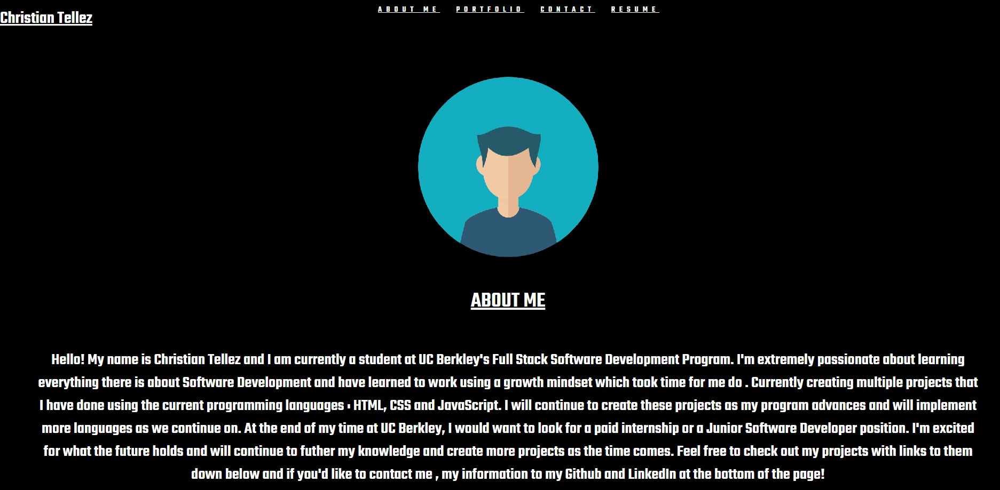
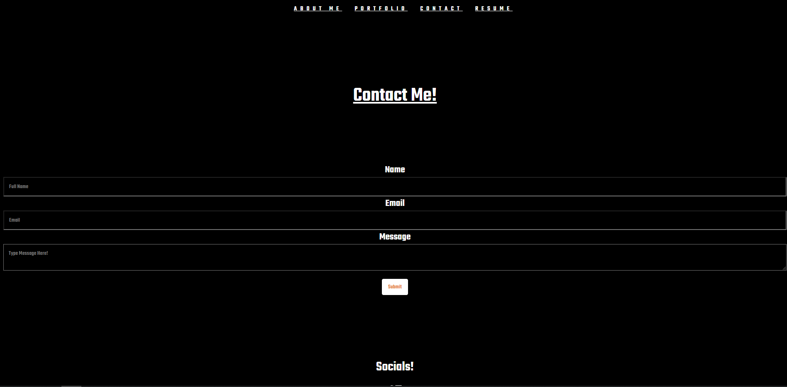
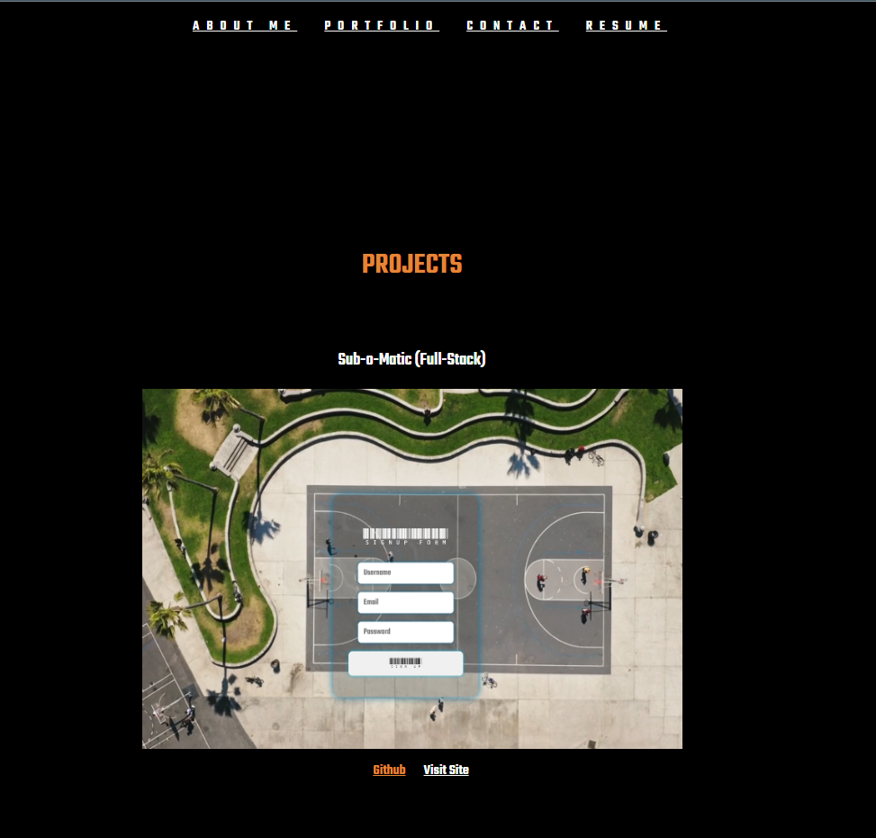

# <em> React-Portfolio
#
## Deploy Link : https://christians-react-portfolio.netlify.app/

## Badges

## <em> Description
Created a portfolio using React and displayed previous projects, contact form, resume link, and a about me with links to my socials!
## <em>Visuals

About me page. Also set as the main page when loaded in

 Contact Me portion of the portfolio

 Section where previous projects are displayed with active links to Github and Deployed Link to project

## <em> License
[MIT](./license.md)